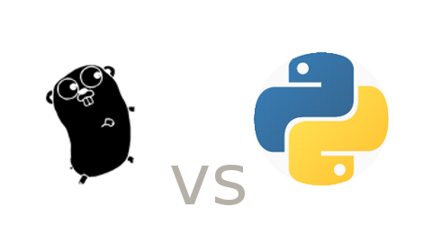

```{r}
library(here)
library(tidyverse)
library(lubridate)
library(timeDate)
library(resample)

theme_set(theme_bw())
```


```{r}
readr::read_csv(here::here("data/github-users-committing-filetypes.csv"),
                      progress = FALSE,
                      col_types = cols(
                        file_extension = col_character(),
                        month_day = col_integer(),
                        the_month = col_integer(),
                        the_year = col_integer(),
                        users = col_integer()
                        )) -> data
data %>% 
  glimpse()
```


## Objetivo da analise.
Esta análise, realizada no contexto da disciplina Ciência de Dados 1, tem por objetivo avaliar a popularidade de linguagens de programação no período entre 2016 e 2017 segundo dados registrados no GitHub. Essa análise serve de mote para trabalharmos conceitos de inferência, intervalos de confiança, significância, entre outros.

## Sobre os dados
Usaremos uma amostra de dados que contém informações sobre quantos usuários fizeram atividade no GitHub usando uma determinada linguagem de programação.
Em especial escolhemos as Linguagens Go e Python.
Para está analise iremos verificar se a data é no final de semana ou não para facilitar a observação.
```{r}
data %>%
  mutate(cronology = lubridate::ymd(paste(the_year,
                         the_month,
                         month_day)),
         isWeekend = timeDate::isWeekend(cronology)) -> data
```



### Python 
É uma linguagem de programação de alto nível, interpretada, de script, imperativa, orientada a objetos, funcional, de tipagem dinâmica e forte. 

### Go
É uma linguagem de programação criada pela Google e lançada em código livre. É uma linguagem compilada e focada em produtividade e programação concorrente.

```{r}
dados = data  %>% filter(file_extension %in% c("go","py"))
```

### Conhecendo os dados

```{r}
head(dados)
```

Cada observação contém a linguagem de programação (file_extension, que propriamente dito é a extensão do arquivo modificado no GitHub, mas, a partir dela, podemos mapear para a linguagem de programação em questão), quantos usuários fizeram atividade nessa linguagem (users) e o dia do mês (month_day), o mês (the_month) e o ano (the_year) em que ocorreram as modificações e se a data em questão foi um final de semana (isWeekend).

Para melhorar analise podemos dividir em duas base de dados separando as linguagens entre si. 
```{r}
dados.py = dados %>%
          filter(file_extension == "py")
dados.go = dados %>%
          filter(file_extension == "go")
```


## Perguntas.
A analise abaixo tem como principal objetivo responder esses questionamentos:
  * Para uma determinada linguagem, há uma diferença significativa na sua popularidade durante a semana e durante o fim de semana? Essa diferença é grande?
  * Comparandao duas linguagens, existe uma diferença significativa entre elas na sua variação de popularidade nos finais de semana?


## Para cada uma delas, há uma diferença significativa na sua popularidade durante a semana e durante o fim de semana? Essa diferença é grande?

### Analisando com a Linguagem Go
Abaixo iremos observar como está linguagem se comporta em relação ao final de semana e dias de semana.

```{r}
dados.go %>% 
  ggplot(aes(x= users ,y = isWeekend)) + geom_jitter(width = .1, colour = "blue",alpha=0.6)+
  labs(title = "Atividade de usuários Go", x = "Usuários", y = "Fim de semana")
```

Cada ponto é um dia em que houve atividade no GitHub para a linguagem Go. Esse dia pode ter sido no final de semana ou não. Vemos que há uma concentração de dias que não são finais de semana e em que houve um número alto de usuários que programaram em Go. Em contrapartida, há uma concentração de dias que são do final de semana e em que houve um número mais baixo de usuários. Isso nos sugere que Go é mais popular em dias de semana do que em finais de semana.

Como estamos trabalhando apenas com uma amostra, essa visualização não é suficiente para responder com confiança se Go é mais popular no final de semana ou não. Usaremos uma técnica de inferência chamada bootstrap para coletar informações da amostra e criar um panorama onde nossas conclusões tenham cerca de 95% de confiança.

Em linha gerais, a técnica bootstrap funciona da seguinte maneira:

+ Reescreve um conjunto de dados do mesmo tamanho da amostra original n vezes.
+ Calcula a estatísca para cada amostra gerada;
+ Encontra o desvio padrão desta estatística;

```{r}
# Mediana dos grupos separados

b1 = dados.go %>% 
  filter(isWeekend == TRUE) %>%
  bootstrap(median(users))

median.go.fds = b1 %>% 
  CI.percentile(probs = c(.025, .975))

b2 = dados.go %>% 
  filter(isWeekend != TRUE) %>%
  bootstrap(median(users))

median.go.naofds = b2 %>% 
  CI.percentile(probs = c(.025, .975))

df.medias = data.frame(rbind(median.go.fds, median.go.naofds))
df.medias$medida = c("Final de Semana", "Dia de Semana")

df.medias %>% 
  ggplot(aes(x=medida, ymin = X2.5., ymax = X97.5.)) + 
  geom_errorbar(width = .2, color=" darkblue") + 
  geom_hline(yintercept = 0, colour = "deeppink")
  
  
```

Observamos que os intervalos de Dia de Semana e Final de Semana não se interceptam. Além disso podemos observar que em Dia de Semana atinge valores mais alto. Isso nos leva a concluir que Go é significatvivamente mais popular durante os dias da semana.

### Analisando com a linguagem Python.
Abaixo iremos observar como está linguagem se comporta em relação ao final de semana e dias de semana.
```{r}
dados.py %>% 
  ggplot(aes(x= users ,y = isWeekend)) + geom_jitter(width = .1, colour = "blue",alpha=0.6)+
  labs(title = "Atividade de usuários Python", x = "Usuários", y = "Fim de semana")
```

Podemos observar o mesmo fenomeno que na linguagem Go em relação ao Final de Semana e Dia de Semana, porém notamos também que linguagem python possui mais usuarios que a linguagem Go.
Como no processo estabelecido da linguagem Go iremos aplicar para Python e observar com mais confiaça tal fenomeno. 
```{r}
# Mediana dos grupos separados

b1 = dados.py %>% 
  filter(isWeekend == TRUE) %>%
  bootstrap(median(users))

median.py.fds = b1 %>% 
  CI.percentile(probs = c(.025, .975))

b2 = dados.py %>% 
  filter(isWeekend != TRUE) %>%
  bootstrap(median(users))

median.py.naofds = b2 %>% 
  CI.percentile(probs = c(.025, .975))

df.medias = data.frame(rbind(median.go.fds, median.py.naofds))
df.medias$medida = c("Final de Semana", "Dia de Semana")

df.medias %>% 
  ggplot(aes(x=medida, ymin = X2.5., ymax = X97.5.)) + 
  geom_errorbar(width = .2, color=" darkblue") + 
  geom_hline(yintercept = 0, colour = "deeppink")
  
```

Podemos observar o mesmo fenomeno da linguagem go só que para Python observamos pelo fato do numero de usuario maior a diferença dos intervalos ainda maior para este caso. Vemos que os intervalos para dia de semana e final de semana não se interceptam. E para dias de semana o valor do intervalo é bem maior. Assim concluimos que Python é significatvivamente mais popular durante os dias da semana.

## Comparandao duas linguagens, existe uma diferença significativa entre elas na sua variação de popularidade nos finais de semana?
Para está analise iremos comparar a popularidade, nos fins de semana, entre as duas lingaugens, para verificar qual delas tem maior variação.

```{r}
mean.diff.ci = bootstrap2(data = (dados.py %>% filter(isWeekend == TRUE))$users, 
                        data2 = (dados.go %>% filter(isWeekend  == TRUE))$users,
                        sd) %>%
  CI.percentile(probs = c(.025, .975))

data.frame(mean.diff.ci) %>% 
  ggplot(aes(x = "Diferença", ymin = X2.5., ymax = X97.5.)) + 
  geom_errorbar(width = .2, colour="darkblue") + 
  geom_hline(yintercept = 0, colour="gold3")
```

Como o intervalo é positivo e alto, podemos afirmar que há uma diferença significativa na popularidade de Python e Go entre os programadores nos fins de semana.


